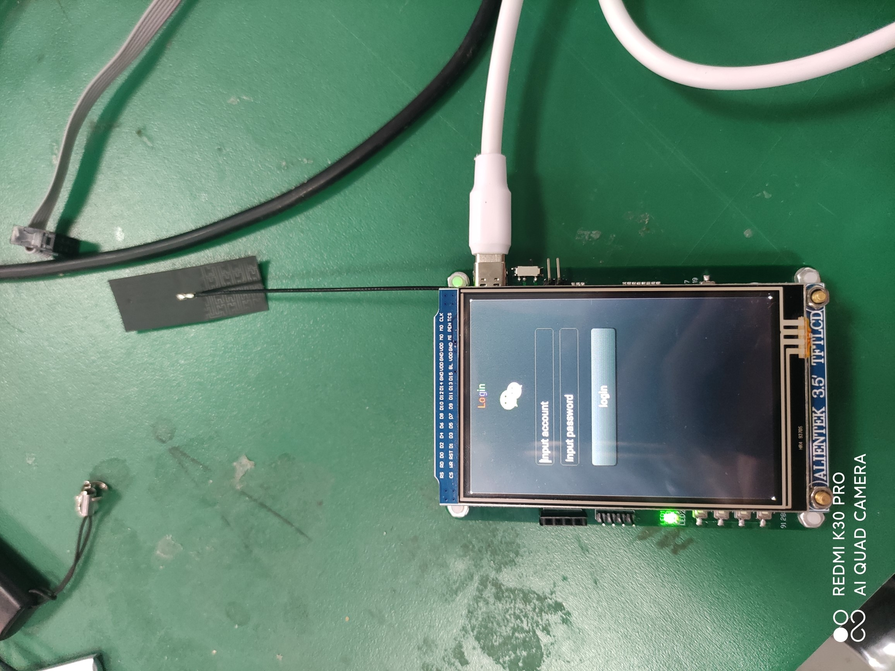
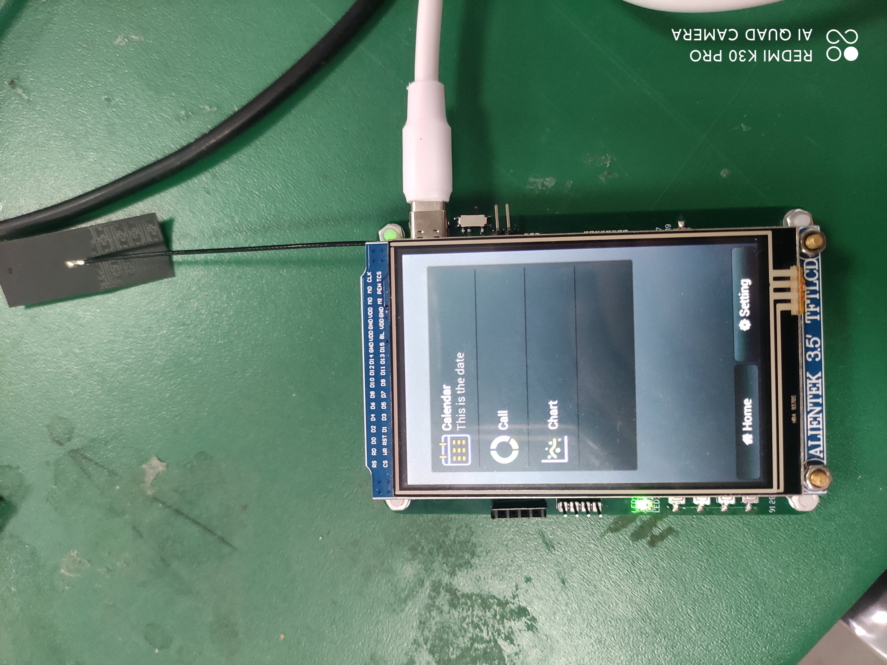
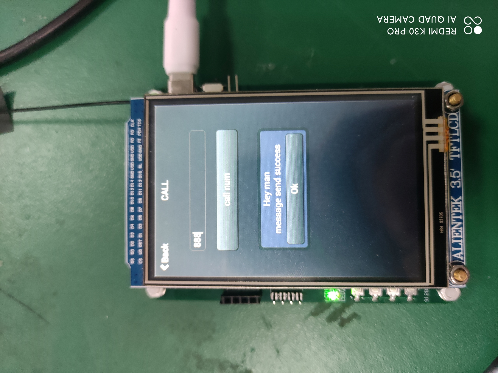
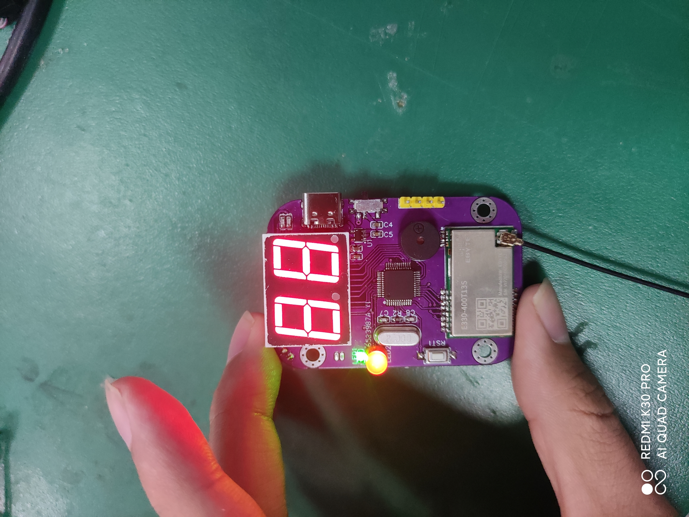
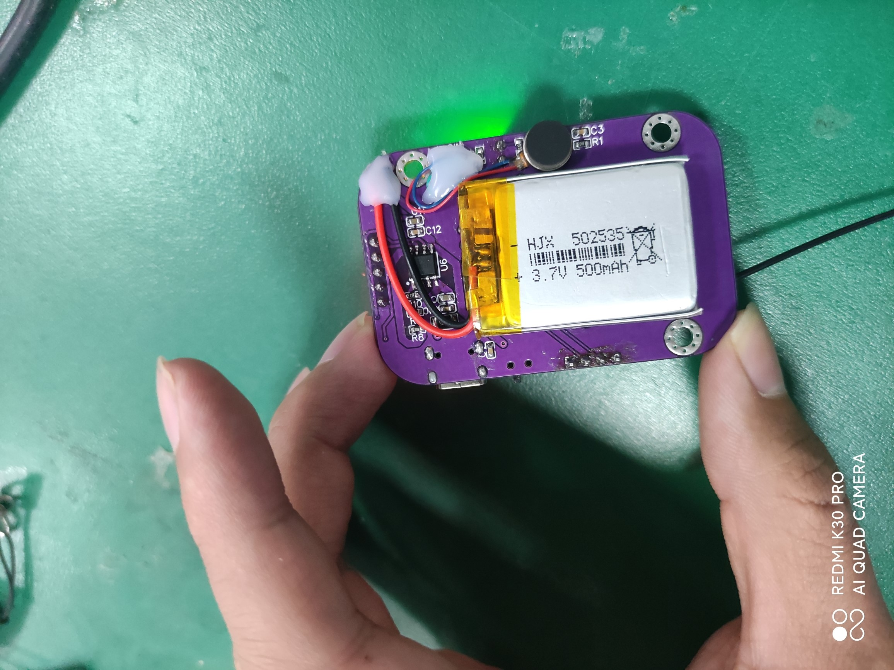
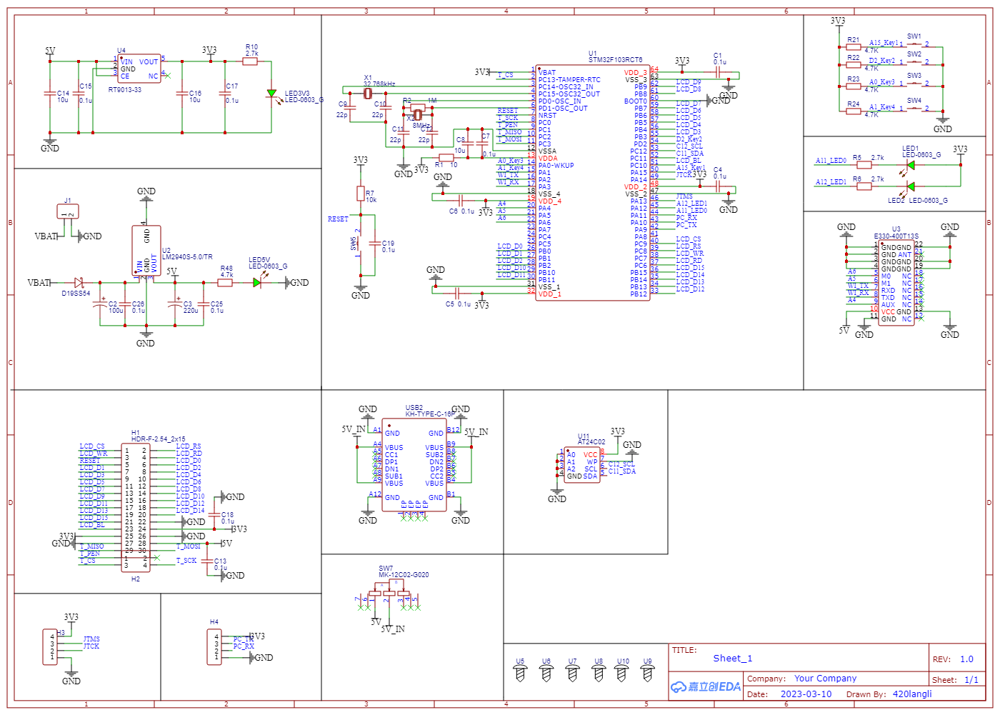
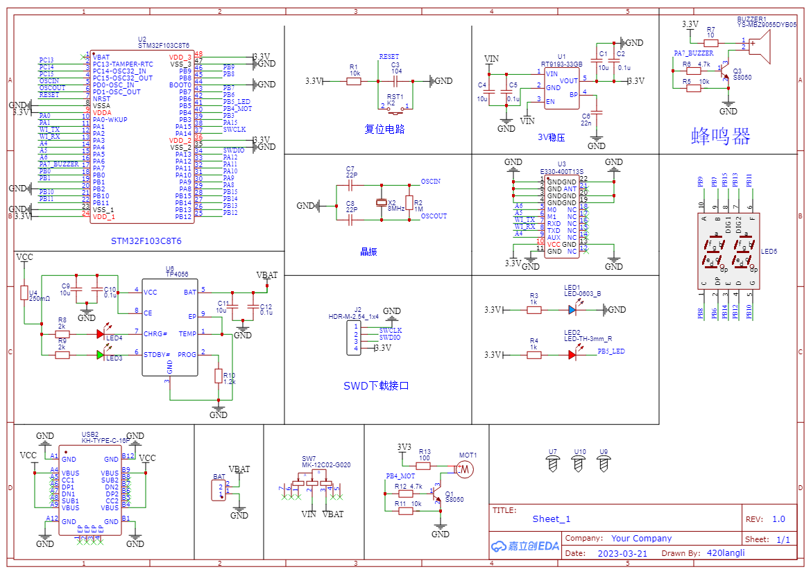

# 餐厅无线点餐系统

## 项目简介

​		该项目是一款基于STM32f1系列单片机、Lora通信模块和LCD触摸屏的餐厅无线点餐系统。该系统分为主从机两部分，主机采用stm32f103rct6芯片作为主控，使用Little VGL(LVGL)设计主机UI显示，并支持账号密码登录、无线呼叫、日历显示以及销量储存等功能。从机则使用stm32f103c8t6芯片作为主控，能够实现无线呼叫信号接收、多种报警方式（如蜂鸣器、LED、震动马达）以及电池充放电等功能。主从机之间采用Lora通信模块进行通信，具有传输距离远和稳定性高等优点。

## 实物展示

## 主机原理图

## 从机原理图

